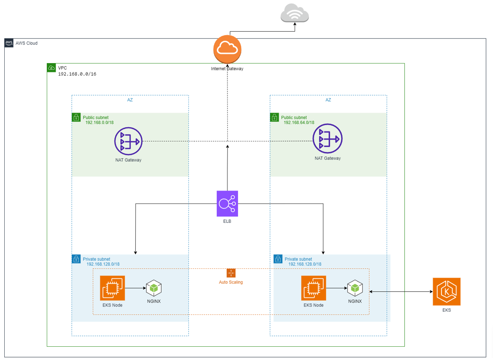
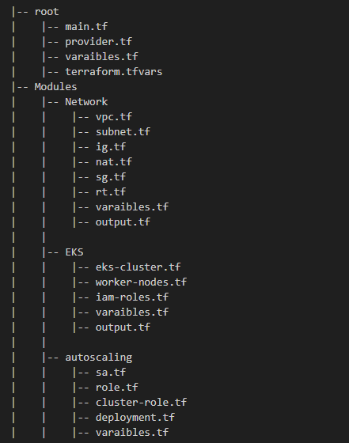

# Guide for Setting up EKS with Autoscaling
This demo project showcases the process of establishing an autoscaling EKS cluster on AWS. It follows the instructions provided in the [Creating An autoscalable AWS EKS](https://www.coursera.org/learn/iinsha-tatbiq-qabil-liltawasue-biastikhdam-aws-eks-aabr-aws-console/home/week/1) and automates the creation using Terraform.

---
# Terraform Strcuture
Utilized AWS resources for deploying and running the application using Terraform. The infrastructure was set up as follows:

1. Virtual Private Cloud (VPC): A dedicated and isolated VPC was established to ensure secure networking and resource isolation.
2. AWS EKS: A creation of AWS EKS Kubernetes cluster.
3. Autoscaling: Converted a YAML file into Terraform configuration to deploy all autoscaling manifest files onto the EKS cluster, ensuring efficient scaling of resources.

## Getting Started
To begin, follow these steps:
- Clone project.
- Initiate the infrastructure provisioning with the command `terraform apply --auto-approve`, resulting in the creation of 38 resources on AWS.
- Configure the /kube/config file to reference the created cluster by executing the command: ` aws eks update-kubeconfig --region eu-west-1 --name eks-cluster-test`
- Navigate to project file and excute ` kubectl apply -f nginx.yaml `
- Edit nginx manifest to increase/dcrease number of nginx pod and apply configuration, autoscaling will do its work.

## Clean up 
- To Clean up resources, execute  ` terraform destroy --auto-approve `. 
